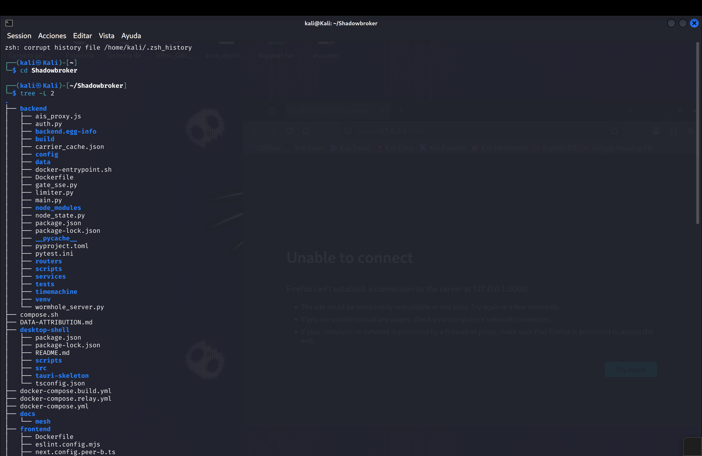
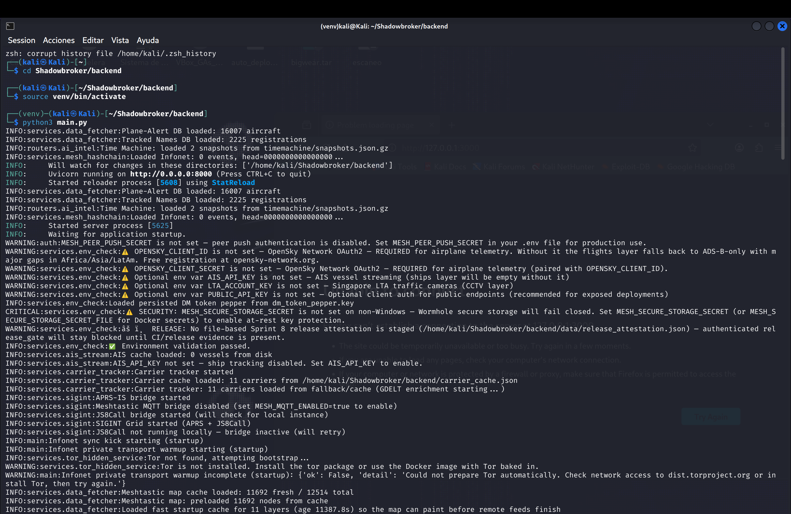
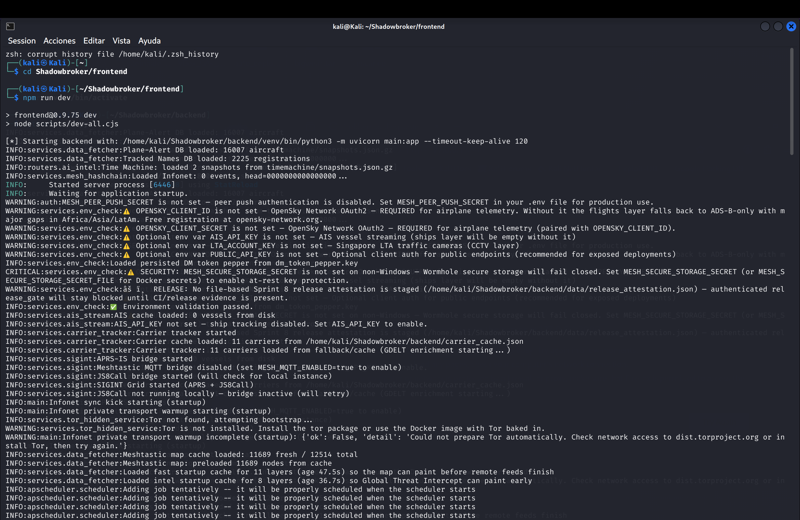
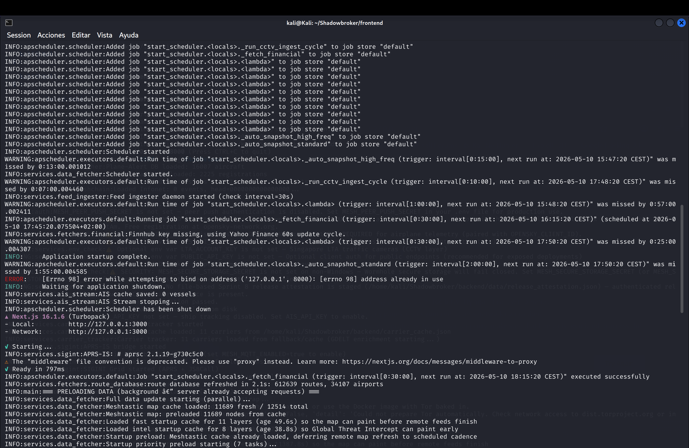
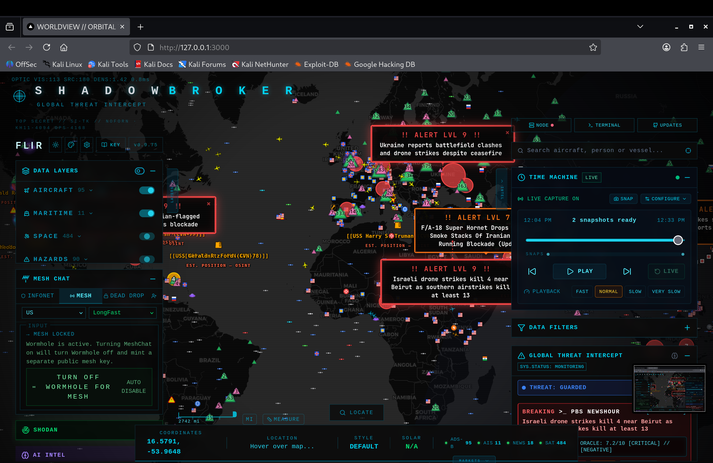
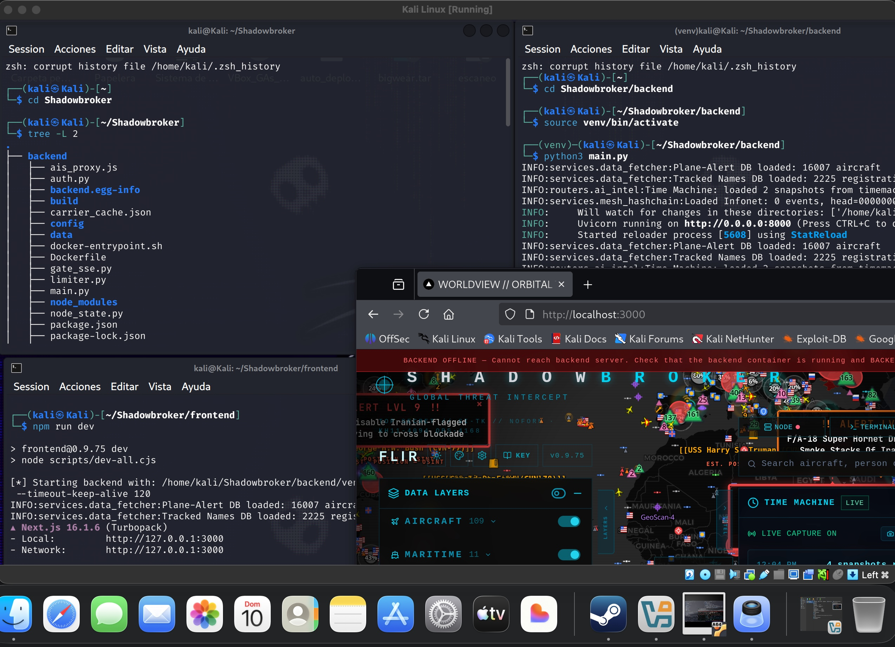

** ShadowBroker

OSINT global threat monitoring platform built FastAPI and Next.js

* Overview

ShadowBroker is a cyberpunk-inspired intelligence dashboard designed to visualize real-time global activity across multiple data layers including:

- Aircraft telemetry
- Maritime tracking
- Satellite layers
- Global threat alerts
- Time-machine snapshots
- Mesh communication simulation
- AI intelligence feeds

The project combines FastAPI services with a Next.js frontend focused on immersive UI/UX and real-time visualization.

---

 ** Tech Stack

* Frontend
- Next.js
- TypeScript
- TailwindCSS

* Backend
- FastAPI
- Python
- Uvicorn

* Data Sources
- OSINT feeds
- Aircraft telemetry
- Maritime datasets
- Threat intelligence streams

---

* Features

- Real-time world map visualization
- Aircraft and maritime monitoring
- Threat alert overlays
- Snapshot time-machine playback
- Interactive cyberpunk dashboard
- Modular FastAPI backend services
- Mesh communication simulation

---

* Project Structure



---

* Backend Startup



---

* Frontend Startup





---

* Dashboard



---

* Full Overview



---

* Run Locally

* Backend

```bash
cd backend
source venv/bin/activate
python3 main.py
```

* Frontend

```bash
cd frontend
npm install
npm run dev
```

---

** Author

Ricardo Gomez Sanzonetti

GitHub:
https://github.com/ricardosanzonetti
